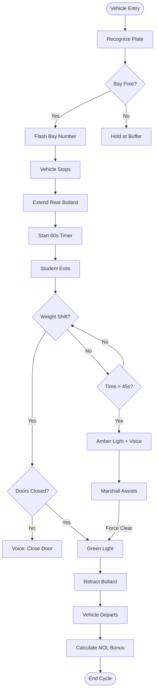

# ⚡ NEXUS: The 60-Second Drop-off Protocol
## "The Critical Minute" — A Choreographed Pit Stop Mechanics Guide

---

## 🎯 Concept: Formula 1 Efficiency
Standard school drop-offs are chaotic and open-ended. **NEXUS** treats every drop-off as a precision "Pit Stop" with a strictly defined 60-second window.

### The Phases of the Minute

```mermaid
gantt
    title The Precision Drop-off Timeline
    dateFormat s
    axisFormat %S
    
    section Phase 1: Entry (0-10s)
    Identify & Verify      :active, 0, 5s
    Guide to Bay           :active, 5, 10s
    
    section Phase 2: Action (10-35s)
    Unlock & Unbuckle      :crit, 10, 15s
    Student Exit (Kerb)    :crit, 15, 35s
    Bag Retrieval          :crit, 15, 35s
    
    section Phase 3: Exit (35-60s)
    Safety Check           :active, 35, 45s
    Merge & Depart         :active, 45, 60s
```

### 🧠 Logic Flowchart (Decision Tree)

---

## 🏎️ Detailed Mechanics

### Phase 1: Precision Entry (0:00 - 0:10)
**Goal: Eliminate "Searching" for a spot**

| Driver Action | System Response |
|---------------|-----------------|
| Approaches Zone B | **Camera (YOLO v8)**: Identifies license plate `A-59302` |
| Looks for spot | **Overhead DMS**: Flashes `BAY B3` (Assigned spot) |
| Steers vehicle | **Lane Lights**: Green LEDs light up path *only* to Bay B3 |

> **Efficiency Gain**: Eliminates the 15-30 second "decision hesitation" and "spot hunting".

---

### Phase 2: The Action (0:10 - 0:35)
**Goal: Safe, Rapid Disembarkation**

| Driver Action | System Response |
|---------------|-----------------|
| Stops in Bay B3 | **Bollard**: Automatic bollard behind vehicle EXTENDS (Protects rear) |
| Unlocks doors | **App**: Plays gentle "ding-dong" chime (Audio cue) |
| Child exits | **Safety Marshall**: School staff opens rear door (Kerb side only) |
| Bag retrieval | **Walkway**: Painted "Safe Path" guides child to gate |

> **Safety Interlock**: Physical bollard prevents reverse movement or rear-end collisions during disembarkations.

---

### Phase 3: Clear & Depart (0:35 - 0:45)
**Goal: Instant Verification**

| Driver Action | System Response |
|---------------|-----------------|
| Child clear | **Inductive Loop**: Detects weight shift (passenger left) |
| Doors close | **Side Camera**: Verifies doors closed |
| Ready to go | **Overhead Signal**: Turns **GREEN** |
| Wait? | **App Notification**: "Safe to go! +1.0 NOL Credit secured ✅" |

---

### Phase 4: Laminar Exit (0:45 - 1:00)
**Goal: Conflict-Free Merge**

| Driver Action | System Response |
|---------------|-----------------|
| Accelerates | **Bollard**: Retracts instantly |
| Merges left | **Downstream Signal**: Holds cross-traffic RED for 10s |
| Exits zone | **NOL System**: Processes reward (+0.25 bonus for fast exit) |

---

## 🛑 Handling Exceptions (The "Pit Crew" Response)

### Scenario A: The "Slow Goodbye" (Dwell time > 45s)
1. **0:45**: Overhead light flashes **AMBER**.
2. **App**: Voice prompt: *"Please proceed safely, time is up."*
3. **Marshall**: Steps forward to assist/hurry.

### Scenario B: The "Stalled Engine" (Dwell time > 90s)
1. **0:90**: Overhead light flashes **RED**.
2. **System**: Marks bay as "OUT OF SERVICE".
3. **DMS**: Directs next car to `BAY B4` (skipping blocked spot).
4. **App**: Alert to marshall: *"Assistance needed at Bay B3"*

---

## 📊 Why This Works

| Metric | Traditional Drop-off | NEXUS Protocol |
|--------|----------------------|----------------|
| **Spot Selection** | Random / Hesitant | Assigned / Guided |
| **Safety** | Parent check | Sensor verified |
| **Duration** | 90 - 180 seconds | < 60 seconds |
| **Throughput** | ~20 cars/hr/bay | **60 cars/hr/bay** |

> [!IMPORTANT]
> **3x Capacity Increase**: By standardizing the time to 60s, a school with 10 bays can process **600 cars per hour** — enough for the entire morning rush.

---

*Verified Drop-Off Standard — RTA Hackathon 2026*
