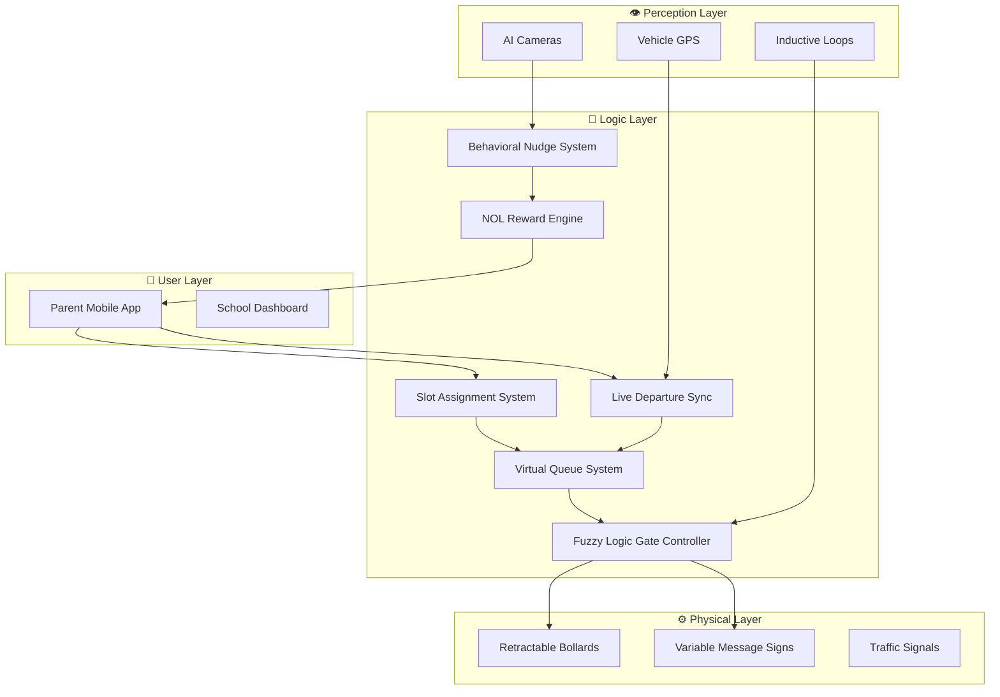
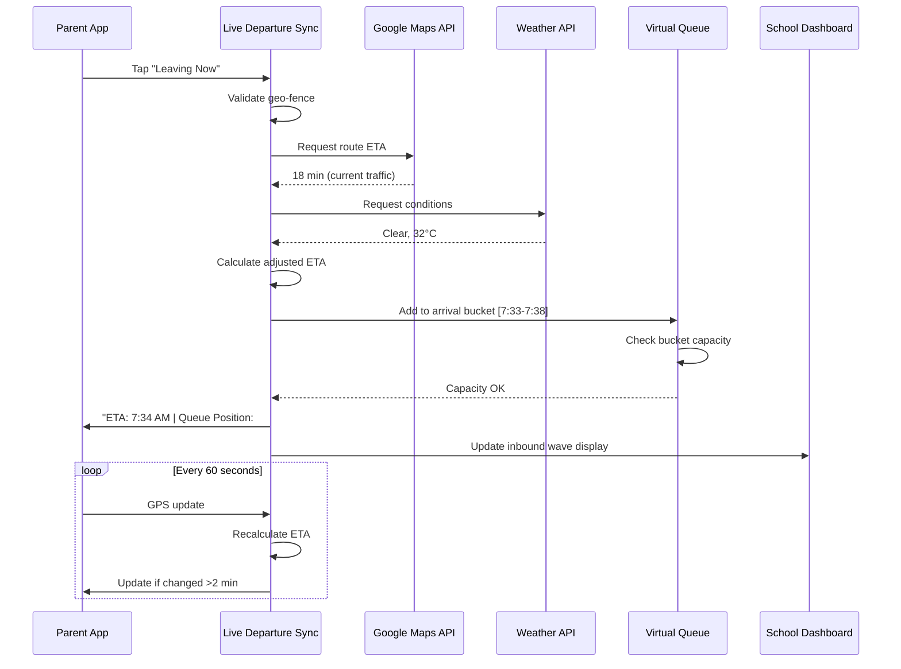
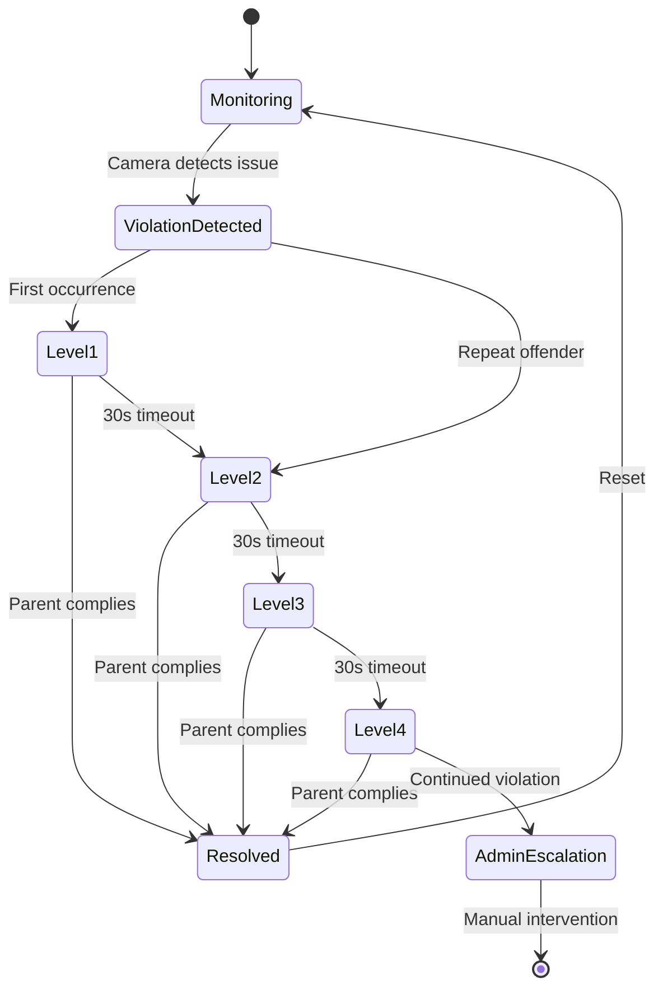
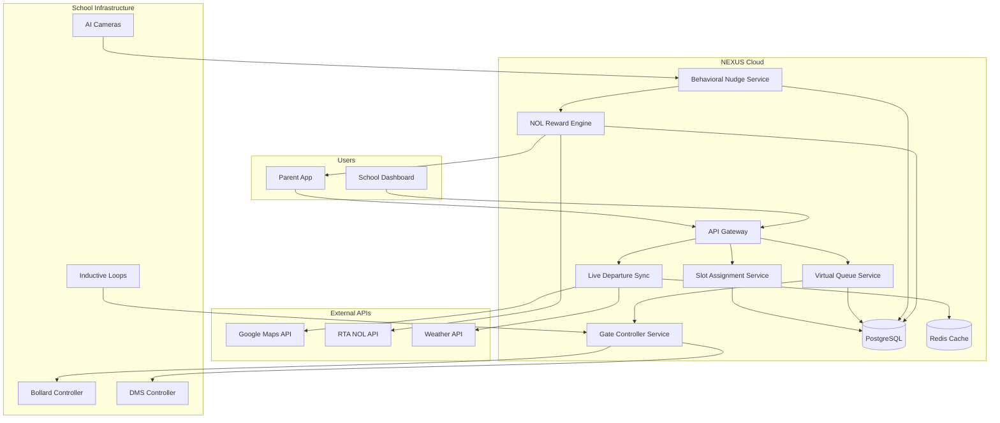

# 🧠 RTA NEXUS: Complete System Logic
## Technical Deep-Dive into Decision Algorithms & Control Flow

---

> [!NOTE]
> This document provides a detailed technical breakdown of the NEXUS system logic, suitable for engineers and technical reviewers.

---

## Table of Contents

1. [System Architecture Overview](#system-architecture-overview)
2. [Phase 1: Slot Assignment Logic](#phase-1-slot-assignment-logic)
3. [Phase 2: Live Departure Sync (LDS)](#phase-2-live-departure-sync-lds)
4. [Phase 3: Virtual Queue System (VQS)](#phase-3-virtual-queue-system-vqs)
5. [Phase 4: Fuzzy Logic Gate Controller (FLGC)](#phase-4-fuzzy-logic-gate-controller-flgc)
6. [Phase 5: Behavioral Nudge System (BNS)](#phase-5-behavioral-nudge-system-bns)
7. [Phase 6: NOL Reward Engine](#phase-6-nol-reward-engine)
8. [Edge Case Handling](#edge-case-handling)
9. [Failure Mode Logic](#failure-mode-logic)
10. [API & Data Flow](#api--data-flow)

---

## System Architecture Overview

### Core Principle: Arrival Rate Control

The fundamental problem of school zone congestion:

```
λ (Arrival Rate) > μ (Service Rate) → Queue Forms → Congestion
```

**NEXUS Solution:**

```
Control λ to match μ → Queue ≈ 0 → No Congestion
```

### System Components



---

## Phase 1: Slot Assignment Logic

### 1.1 Staggered Arrival Scheduling (SAS)

**Goal:** Distribute N families across time window W such that arrival rate never exceeds capacity.

#### Input Parameters

| Parameter | Symbol | Typical Value | Source |
|-----------|--------|---------------|--------|
| Total enrolled students | N | 500 | School database |
| Drop-off zone capacity | C | 8 vehicles | Physical measurement |
| Average drop-off duration | T_avg | 45 seconds | Historical data |
| Safety factor | SF | 1.3 | Engineering standard |
| Arrival window | W | 45 minutes | School policy |

#### Algorithm

```python
def calculate_slot_structure(N, C, T_avg, SF, W):
    """
    Calculate optimal slot distribution
    """
    # Effective drop-off time with buffer
    T_effective = T_avg * SF  # 45 * 1.3 = 58.5 seconds
    
    # Vehicles per minute capacity
    throughput = (C * 60) / T_effective  # (8 * 60) / 58.5 = 8.2 vehicles/min
    
    # Total capacity in window
    total_capacity = throughput * W  # 8.2 * 45 = 369 vehicles
    
    # Slot duration (how often new batch released)
    slot_duration = 60 / throughput  # 60 / 8.2 = 7.3 seconds
    
    # Round up to practical interval
    slot_interval = 5  # 5-minute slots for simplicity
    
    # Number of slots
    num_slots = W / slot_interval  # 45 / 5 = 9 slots
    
    # Families per slot
    families_per_slot = ceil(N / num_slots)  # 500 / 9 = 56 families/slot
    
    return {
        'slot_interval': slot_interval,
        'num_slots': num_slots,
        'families_per_slot': families_per_slot,
        'max_throughput': throughput
    }
```

#### Constraint Satisfaction for Assignment

```python
def assign_family_to_slot(family, available_slots, constraints):
    """
    Assign family to optimal slot considering constraints
    """
    constraints = {
        'sibling_same_slot': True,      # Families with multiple kids get one slot
        'geographic_spread': True,       # Nearby homes staggered
        'preference_matching': True,     # Honor parent preferences when possible
        'capacity_limit': families_per_slot  # Never exceed slot capacity
    }
    
    # Get siblings
    siblings = get_siblings(family)
    
    # If siblings exist, use existing assignment
    if siblings:
        existing_slot = get_sibling_slot(siblings[0])
        if slot_has_capacity(existing_slot):
            return existing_slot
    
    # Score each slot
    slot_scores = []
    for slot in available_slots:
        score = 0
        
        # Preference match (parent requested this time)
        if slot.time == family.preferred_time:
            score += 50
        
        # Geographic spread (avoid convoy from same neighborhood)
        neighbors_in_slot = count_neighbors(family.location, slot)
        score -= neighbors_in_slot * 10
        
        # Capacity (prefer less full slots)
        score += (slot.capacity - slot.current) * 5
        
        slot_scores.append((slot, score))
    
    # Return best slot
    return max(slot_scores, key=lambda x: x[1])[0]
```

#### Output: Weekly Schedule

```
┌─────────────────────────────────────────────────────────────────┐
│                 WEEKLY SLOT ASSIGNMENT OUTPUT                   │
├─────────────────────────────────────────────────────────────────┤
│                                                                 │
│   SLOT 1: 7:15 - 7:20 AM                                        │
│   ├── Families: 56                                              │
│   ├── Expected arrivals: 11.2/min                               │
│   └── Gate: A (28), B (28)                                      │
│                                                                 │
│   SLOT 2: 7:20 - 7:25 AM                                        │
│   ├── Families: 56                                              │
│   ├── Expected arrivals: 11.2/min                               │
│   └── Gate: A (28), B (28)                                      │
│                                                                 │
│   ... (9 slots total)                                           │
│                                                                 │
│   SLOT 9: 7:55 - 8:00 AM                                        │
│   ├── Families: 52 (remainder)                                  │
│   ├── Expected arrivals: 10.4/min                               │
│   └── Gate: A (26), B (26)                                      │
│                                                                 │
└─────────────────────────────────────────────────────────────────┘
```

---

## Phase 2: Live Departure Sync (LDS)

### 2.1 Purpose

Transform static slot assignments into dynamic, real-time arrival prediction.

### 2.2 Trigger Event

```python
def on_leaving_now_tap(parent_id, timestamp, gps_location):
    """
    Called when parent taps "Leaving Now" button
    """
    # Validate geo-fence (must be within 5km of school or at home)
    if not validate_location(gps_location, parent_id):
        return error("Please enable GPS to check in")
    
    # Validate not too early (can't check in 2 hours before slot)
    if timestamp < parent.slot_time - timedelta(hours=2):
        return error("Check-in opens 2 hours before your slot")
    
    # Proceed with LDS activation
    return activate_lds(parent_id, gps_location, timestamp)
```

### 2.3 ETA Calculation

```python
def calculate_eta(parent_id, current_location, timestamp):
    """
    Calculate real-time ETA using multiple data sources
    """
    school_location = get_school_location()
    
    # Source 1: Google Maps / TomTom real-time traffic
    api_eta = traffic_api.get_route_time(
        origin=current_location,
        destination=school_location,
        departure_time=timestamp
    )
    
    # Source 2: Historical data for this parent
    historical_avg = get_parent_historical_travel_time(parent_id)
    
    # Source 3: Weather adjustment
    weather = get_current_weather()
    weather_factor = 1.0
    if weather.is_raining:
        weather_factor = 1.15  # 15% longer in rain
    if weather.is_foggy:
        weather_factor = 1.10
    
    # Source 4: Day-of-week adjustment
    dow_factor = get_day_of_week_factor(timestamp.weekday())
    
    # Weighted combination
    base_eta = (api_eta * 0.6) + (historical_avg * 0.4)
    adjusted_eta = base_eta * weather_factor * dow_factor
    
    # Add buffer for uncertainty
    buffer = max(60, adjusted_eta * 0.1)  # 10% or 1 min minimum
    
    final_eta = timestamp + timedelta(seconds=adjusted_eta + buffer)
    
    return EtaResult(
        predicted_arrival=final_eta,
        confidence=calculate_confidence(api_eta, historical_avg),
        factors={
            'traffic': api_eta,
            'historical': historical_avg,
            'weather': weather_factor,
            'day_of_week': dow_factor
        }
    )
```

### 2.4 Inbound Wave Management

```python
def manage_inbound_wave():
    """
    Continuously monitor all en-route parents and adjust system
    """
    # Build arrival prediction map (5-minute buckets)
    buckets = defaultdict(list)
    
    for parent in get_active_departures():
        bucket = round_to_5_min(parent.predicted_arrival)
        buckets[bucket].append(parent)
    
    # Check each bucket against capacity
    for bucket_time, parents in buckets.items():
        expected_arrivals = len(parents)
        bucket_capacity = calculate_bucket_capacity()  # ~40 vehicles per 5 min
        
        if expected_arrivals > bucket_capacity * 1.2:  # 20% over
            # SURGE DETECTED
            handle_surge(bucket_time, parents, expected_arrivals, bucket_capacity)

def handle_surge(bucket_time, parents, expected, capacity):
    """
    Handle detected surge in arrivals
    """
    overflow = expected - capacity
    
    # Sort parents by flexibility (who can we delay?)
    # Priority: Already driving < Just left < Still at home
    sortable_parents = sorted(parents, key=lambda p: p.departure_time, reverse=True)
    
    # Delay the most recently departed (most flexibility)
    for parent in sortable_parents[:overflow]:
        if parent.status == 'AT_HOME':
            # Best case: haven't left yet
            send_notification(parent, 
                f"Traffic ahead. Best departure time: {bucket_time + 10} min"
            )
        elif parent.status == 'DRIVING' and parent.time_in_car < 5:
            # Just left: can slow down
            send_notification(parent,
                "Slow traffic ahead. Drive normally, you'll be guided to staging."
            )
        else:
            # Already committed: route to staging
            send_notification(parent,
                f"High volume. Please wait at {get_nearest_staging(parent.location)}"
            )
```

### 2.5 LDS Data Flow



---

## Phase 3: Virtual Queue System (VQS)

### 3.1 Queue Architecture

```python
class VirtualQueue:
    def __init__(self, school_id):
        self.school_id = school_id
        self.queue = PriorityQueue()  # Priority by ETA
        self.staging_zones = load_staging_zones(school_id)
        self.capacity_per_5min = 40
        
    def add_to_queue(self, parent, eta):
        """
        Add parent to virtual queue
        """
        queue_entry = QueueEntry(
            parent_id=parent.id,
            check_in_time=now(),
            predicted_eta=eta,
            assigned_gate=self.assign_gate(parent),
            status='QUEUED'
        )
        
        self.queue.put((eta, queue_entry))
        
        # Calculate queue position
        position = self.get_position(parent.id)
        
        # Calculate estimated call time
        call_time = self.estimate_call_time(position)
        
        return QueueResult(
            position=position,
            estimated_call_time=call_time,
            staging_zone=self.get_staging_zone(parent.location)
        )
    
    def process_queue(self):
        """
        Called every 30 seconds to advance queue
        """
        # Check gate capacity
        for gate in self.gates:
            available_spots = gate.capacity - gate.current_occupancy
            
            if available_spots > 0:
                # Get next N parents from queue
                next_parents = self.get_next_for_gate(gate, available_spots)
                
                for parent in next_parents:
                    self.call_parent(parent, gate)
    
    def call_parent(self, parent, gate):
        """
        Notify parent their turn has arrived
        """
        parent.status = 'CALLED'
        parent.called_time = now()
        parent.assigned_gate = gate.id
        
        # Multi-channel notification
        send_push_notification(parent, 
            f"PROCEED NOW - Gate {gate.id} Open!",
            vibrate=True,
            sound='gate_open.mp3'
        )
        
        # Trigger physical infrastructure
        bollard_controller.retract(gate.bollard_id)
        dms_controller.display(gate.dms_id, f"GATE {gate.id}: OPEN - Welcome #{parent.queue_position}")
        
        # Start arrival countdown (parent must arrive in 5 min or forfeit)
        schedule_timeout(parent.id, minutes=5, action='forfeit_slot')
```

### 3.2 Staging Zone Logic

```python
class StagingZoneManager:
    def __init__(self, school_id):
        self.zones = [
            StagingZone('TIER1', 'Coffee shops', capacity=30, distance_min=2),
            StagingZone('TIER2', 'Side streets', capacity=50, distance_min=3),
            StagingZone('TIER3', 'Community lot', capacity=80, distance_min=5),
            StagingZone('TIER4', 'Overflow lot', capacity=150, distance_min=8),
        ]
        
    def get_staging_assignment(self, parent_location, queue_wait_time):
        """
        Assign parent to optimal staging zone
        """
        # If wait time < 3 min, no staging needed
        if queue_wait_time < 180:
            return StagingAssignment(
                zone=None,
                instruction="Proceed directly to gate approach"
            )
        
        # Find nearest zone with capacity
        for zone in sorted(self.zones, key=lambda z: z.distance_from(parent_location)):
            if zone.has_capacity():
                return StagingAssignment(
                    zone=zone,
                    instruction=f"Wait at {zone.name}",
                    navigation=get_navigation(parent_location, zone.location),
                    estimated_wait=queue_wait_time
                )
        
        # All zones full: ROAMING PROTOCOL
        return self.activate_roaming_protocol(parent_location, queue_wait_time)
    
    def activate_roaming_protocol(self, parent_location, wait_time):
        """
        Handle overflow when all staging zones are full
        """
        # Option 1: Remote overflow lot
        if self.zones['TIER4'].has_capacity():
            return StagingAssignment(
                zone=self.zones['TIER4'],
                instruction="Staging areas busy. Proceed to overflow lot.",
                bonus_nol=0.50,  # Incentive for using overflow
                navigation=get_navigation(parent_location, self.zones['TIER4'].location)
            )
        
        # Option 2: Dynamic delay (if parent still at home)
        if parent.status == 'AT_HOME':
            return StagingAssignment(
                zone=None,
                instruction=f"Best departure time: {now() + timedelta(minutes=10)}",
                delay_recommended=True
            )
        
        # Option 3: Circling protocol (last resort)
        return StagingAssignment(
            zone=None,
            instruction="High volume. Please circle the block slowly. We'll guide you shortly.",
            monitor_for_spot=True
        )
```

### 3.3 Queue Position Display

```
┌─────────────────────────────────────────────────────────────────┐
│                    PARENT APP: QUEUE VIEW                       │
├─────────────────────────────────────────────────────────────────┤
│                                                                 │
│   ┌─────────────────────────────────────────────────────────┐   │
│   │                                                         │   │
│   │         Your Position: #23 of 47                        │   │
│   │                                                         │   │
│   │         ████████████░░░░░░░░░░ 49%                       │   │
│   │                                                         │   │
│   │         Estimated Wait: 4 min 32 sec                    │   │
│   │                                                         │   │
│   └─────────────────────────────────────────────────────────┘   │
│                                                                 │
│   ┌─────────────────────────────────────────────────────────┐   │
│   │  📍 Current Location: Tim Hortons Parking               │   │
│   │  🚗 Assigned Gate: B                                    │   │
│   │  ⏱️ Your Slot Time: 7:35 AM                             │   │
│   │  💰 NOL Bonus Active: +1.75 AED                         │   │
│   └─────────────────────────────────────────────────────────┘   │
│                                                                 │
│   ┌─────────────────────────────────────────────────────────┐   │
│   │                                                         │   │
│   │   Status: WAITING IN STAGING                            │   │
│   │                                                         │   │
│   │   You'll receive a notification when it's your turn.    │   │
│   │   Please stay near your vehicle.                        │   │
│   │                                                         │   │
│   └─────────────────────────────────────────────────────────┘   │
│                                                                 │
└─────────────────────────────────────────────────────────────────┘
```

---

## Phase 4: Fuzzy Logic Gate Controller (FLGC)

### 4.1 Why Fuzzy Logic?

| Approach | Pros | Cons |
|----------|------|------|
| **Hard Rules** | Simple, predictable | Can't handle nuance |
| **Machine Learning** | Adaptive | Black box, needs data |
| **Fuzzy Logic** | Human-readable, tunable, handles uncertainty | Requires expert design |

**NEXUS Choice:** Fuzzy Logic because RTA engineers can **inspect, understand, and tune** every rule.

### 4.2 Input Variables (Fuzzification)

```python
# Define fuzzy input variables
class FuzzyInputs:
    
    # Queue Length at Gate
    queue_length = {
        'SHORT': FuzzySet(0, 0, 2, 4),    # 0-4 vehicles
        'MEDIUM': FuzzySet(2, 4, 6, 8),   # 2-8 vehicles
        'LONG': FuzzySet(6, 8, 15, 15)    # 6-15+ vehicles
    }
    
    # Zone Occupancy
    zone_occupancy = {
        'EMPTY': FuzzySet(0, 0, 0.2, 0.4),
        'PARTIAL': FuzzySet(0.2, 0.4, 0.6, 0.8),
        'FULL': FuzzySet(0.6, 0.8, 1.0, 1.0)
    }
    
    # Time to School Bell
    time_to_bell = {
        'AMPLE': FuzzySet(15, 20, 45, 45),   # 15+ min
        'MODERATE': FuzzySet(5, 10, 15, 20), # 5-20 min
        'URGENT': FuzzySet(0, 0, 5, 10)      # 0-10 min
    }
    
    # Bus Approaching
    bus_approaching = {
        'NO': FuzzySet(0, 0, 0.3, 0.5),
        'YES': FuzzySet(0.5, 0.7, 1.0, 1.0)
    }
```

### 4.3 Fuzzy Rule Base

```python
# Human-readable fuzzy rules
FUZZY_RULES = [
    # Rule 1: Normal flow
    Rule(
        IF=(queue_length.SHORT, zone_occupancy.EMPTY, time_to_bell.AMPLE, bus_approaching.NO),
        THEN=gate_action.OPEN_WIDE,
        COMMENT="Plenty of time, no queue, no bus - let them through"
    ),
    
    # Rule 2: Moderate load
    Rule(
        IF=(queue_length.MEDIUM, zone_occupancy.PARTIAL, time_to_bell.MODERATE, bus_approaching.NO),
        THEN=gate_action.METERED,
        COMMENT="Controlled flow - release 2, wait 30s, release 2"
    ),
    
    # Rule 3: High load
    Rule(
        IF=(queue_length.LONG, zone_occupancy.PARTIAL, time_to_bell.ANY, bus_approaching.NO),
        THEN=gate_action.THROTTLE,
        COMMENT="Queue building - slow down intake"
    ),
    
    # Rule 4: Zone full
    Rule(
        IF=(zone_occupancy.FULL, bus_approaching.NO),
        THEN=gate_action.HOLD,
        COMMENT="Zone at capacity - hold gate until spot clears"
    ),
    
    # Rule 5: Bus priority
    Rule(
        IF=(bus_approaching.YES),
        THEN=gate_action.HOLD_FOR_BUS,
        COMMENT="Bus arriving - pause private vehicle admission for 60s"
    ),
    
    # Rule 6: Urgent rush
    Rule(
        IF=(time_to_bell.URGENT, queue_length.LONG),
        THEN=gate_action.EMERGENCY_FLOW,
        COMMENT="Bell soon + long queue - open all gates, extend zone timing"
    ),
    
    # Rule 7: Post-bell wind-down
    Rule(
        IF=(time_to_bell.AFTER_BELL, queue_length.ANY),
        THEN=gate_action.RESTRICTED,
        COMMENT="Classes started - only stragglers, one at a time"
    ),
]
```

### 4.4 Defuzzification & Gate Action

```python
def evaluate_gate_decision(gate_id):
    """
    Run fuzzy inference to determine gate action
    """
    # Get current sensor readings
    inputs = {
        'queue_length': camera_system.get_queue_count(gate_id),
        'zone_occupancy': inductive_loops.get_occupancy_ratio(gate_id),
        'time_to_bell': (school_bell_time - now()).total_seconds() / 60,
        'bus_approaching': bus_gps.is_approaching(gate_id)
    }
    
    # Fuzzify inputs
    fuzzified = {}
    for var, value in inputs.items():
        fuzzified[var] = fuzzify(value, FUZZY_INPUTS[var])
    
    # Evaluate rules
    rule_activations = []
    for rule in FUZZY_RULES:
        activation = evaluate_rule(rule, fuzzified)
        if activation > 0:
            rule_activations.append((rule, activation))
    
    # Aggregate outputs
    aggregated = aggregate_outputs(rule_activations)
    
    # Defuzzify to crisp action
    action = defuzzify(aggregated)
    
    # Log for audit trail
    log_decision(gate_id, inputs, fuzzified, rule_activations, action)
    
    return action

def execute_gate_action(gate_id, action):
    """
    Translate fuzzy output to physical commands
    """
    actions = {
        'OPEN_WIDE': lambda: (
            bollard_controller.retract(gate_id),
            set_release_interval(0),  # Continuous flow
            dms_display(gate_id, "GATE OPEN - PROCEED")
        ),
        'METERED': lambda: (
            bollard_controller.retract(gate_id),
            set_release_interval(30),  # 2 cars, wait 30s
            dms_display(gate_id, "GATE OPEN - 2 VEHICLES")
        ),
        'THROTTLE': lambda: (
            bollard_controller.retract(gate_id),
            set_release_interval(60),  # 1 car per minute
            dms_display(gate_id, "SLOW ENTRY - FOLLOW SIGNALS")
        ),
        'HOLD': lambda: (
            bollard_controller.extend(gate_id),
            dms_display(gate_id, "GATE CLOSED - WAIT FOR GREEN")
        ),
        'HOLD_FOR_BUS': lambda: (
            bollard_controller.extend(gate_id),
            dms_display(gate_id, "🚌 BUS ARRIVING - PLEASE WAIT"),
            schedule_reopen(gate_id, seconds=60)
        ),
        'EMERGENCY_FLOW': lambda: (
            bollard_controller.retract_all(),
            extend_zone_timeout(120),
            dms_display_all("ALL GATES OPEN - PROCEED QUICKLY")
        ),
    }
    
    actions[action]()
```

### 4.5 Fuzzy Logic Visualization

```
┌─────────────────────────────────────────────────────────────────┐
│                FUZZY LOGIC DECISION TRACE                       │
├─────────────────────────────────────────────────────────────────┤
│                                                                 │
│   INPUTS (Raw Values):                                          │
│   ├── Queue Length: 5 vehicles                                  │
│   ├── Zone Occupancy: 62%                                       │
│   ├── Time to Bell: 8 minutes                                   │
│   └── Bus Approaching: No                                       │
│                                                                 │
│   FUZZIFIED:                                                    │
│   ├── Queue: SHORT(0.0) MEDIUM(0.75) LONG(0.0)                  │
│   ├── Zone: EMPTY(0.0) PARTIAL(0.9) FULL(0.1)                   │
│   ├── Time: AMPLE(0.0) MODERATE(0.6) URGENT(0.3)                │
│   └── Bus: NO(1.0) YES(0.0)                                     │
│                                                                 │
│   RULES FIRED:                                                  │
│   ├── Rule 2 (Moderate load): Activation = 0.6                  │
│   ├── Rule 3 (High load): Activation = 0.1                      │
│   └── Rule 6 (Urgent rush): Activation = 0.2                    │
│                                                                 │
│   DEFUZZIFIED OUTPUT:                                           │
│   └── Action: METERED (confidence: 0.72)                        │
│                                                                 │
│   COMMAND EXECUTED:                                             │
│   └── Gate B: RETRACT, Release Interval: 30s                    │
│                                                                 │
└─────────────────────────────────────────────────────────────────┘
```

---

## Phase 5: Behavioral Nudge System (BNS)

### 5.1 Detection Logic

```python
class BehavioralDetector:
    def __init__(self, camera_feed):
        self.model = load_yolo_v8('vehicle_detection.pt')
        self.tracker = DeepSORT()
        self.violation_thresholds = {
            'overstaying': 90,      # seconds
            'double_parking': True,  # binary
            'wrong_zone': True,      # binary
            'blocking_exit': True    # binary
        }
    
    def process_frame(self, frame, zone_id):
        """
        Process single camera frame for violations
        """
        # Detect vehicles
        detections = self.model(frame)
        
        # Track across frames
        tracks = self.tracker.update(detections)
        
        violations = []
        for track in tracks:
            # Check overstaying
            if track.zone == 'DROP_ZONE':
                dwell_time = now() - track.entered_zone_at
                if dwell_time > timedelta(seconds=self.thresholds['overstaying']):
                    violations.append(Violation(
                        type='OVERSTAYING',
                        vehicle_id=track.id,
                        duration=dwell_time,
                        severity=self.calculate_severity(dwell_time)
                    ))
            
            # Check double parking
            if not self.is_in_valid_spot(track.position, zone_id):
                violations.append(Violation(
                    type='DOUBLE_PARKING',
                    vehicle_id=track.id,
                    position=track.position
                ))
            
            # Check wrong zone
            if track.assigned_zone != zone_id:
                violations.append(Violation(
                    type='WRONG_ZONE',
                    vehicle_id=track.id,
                    assigned=track.assigned_zone,
                    actual=zone_id
                ))
        
        return violations
```

### 5.2 Intervention Hierarchy

```python
class NudgeEngine:
    def __init__(self):
        self.intervention_levels = [
            InterventionLevel(
                level=1,
                name='SOFT_NUDGE',
                delay=0,
                actions=['push_notification', 'in_app_sound'],
                message="Please move forward when ready 🚗"
            ),
            InterventionLevel(
                level=2,
                name='ZONE_ALERT',
                delay=30,
                actions=['push_notification', 'dms_generic'],
                message="Others are waiting. Please proceed."
            ),
            InterventionLevel(
                level=3,
                name='NOL_IMPACT',
                delay=60,
                actions=['push_notification', 'reduce_nol'],
                message="Today: No NOL bonus earned ❌"
            ),
            InterventionLevel(
                level=4,
                name='ESCALATION',
                delay=90,
                actions=['push_notification', 'notify_admin', 'flag_account'],
                message="Please contact school admin regarding drop-off policy."
            ),
        ]
    
    def handle_violation(self, violation, parent):
        """
        Progressive intervention based on violation severity and history
        """
        # Check parent's violation history
        history = get_violation_history(parent.id)
        
        # Determine starting level based on history
        if len(history.last_30_days) > 3:
            starting_level = 2  # Skip soft nudge for repeat offenders
        else:
            starting_level = 1
        
        # Get appropriate intervention
        level = self.intervention_levels[starting_level - 1]
        
        # Execute actions
        for action in level.actions:
            self.execute_action(action, parent, violation, level.message)
        
        # Schedule escalation if not resolved
        schedule_escalation(
            violation.id, 
            next_level=starting_level + 1,
            delay=level.delay
        )
    
    def execute_action(self, action, parent, violation, message):
        if action == 'push_notification':
            send_push(parent.device_token, message, priority='high')
        
        elif action == 'in_app_sound':
            trigger_in_app_sound(parent.device_token, 'gentle_reminder')
        
        elif action == 'dms_generic':
            # Display generic message (no license plate for privacy)
            dms_display(violation.zone_id, "Zone clearing needed. Please proceed.")
        
        elif action == 'reduce_nol':
            parent.today_nol_multiplier = 0.0
            notify_nol_impact(parent)
        
        elif action == 'notify_admin':
            send_admin_alert(violation.school_id, {
                'type': violation.type,
                'parent_id': parent.id,  # Admin sees ID, not public
                'timestamp': now()
            })
```

### 5.3 Intervention Flow



---

## Phase 6: NOL Reward Engine

### 6.1 Daily Calculation

```python
class NOLRewardEngine:
    def __init__(self):
        self.daily_actions = {
            'PERFECT_DROPOFF': 1.00,  # On-time + <60s dwell
            'ON_TIME_ARRIVAL': 0.50,  # Within ±2 min of slot
            'FAST_EXIT': 0.25,        # Left zone within 45s
        }
        self.streak_bonuses = {
            5: 5.00,    # 5-day perfect week
            20: 25.00,  # 20-day month
            90: 100.00  # Full semester
        }
        self.leaderboard_bonuses = {
            'TOP_1_PERCENT': 50.00,
            'TOP_5_PERCENT': 25.00,
            'TOP_10_PERCENT': 10.00
        }
    
    def calculate_daily_reward(self, parent_id, session_data):
        """
        Calculate NOL reward for today's drop-off
        """
        base_potential = sum(self.daily_actions.values())  # 1.75 AED
        
        earned = 0.0
        breakdown = []
        
        # Check each action
        if self.is_on_time(session_data):
            earned += self.daily_actions['ON_TIME_ARRIVAL']
            breakdown.append(('On-time arrival', 0.50))
        
        if session_data.dwell_time < 60:
            earned += self.daily_actions['PERFECT_DROPOFF']
            breakdown.append(('Fast drop-off', 1.00))
        
        if session_data.exit_time < 45:
            earned += self.daily_actions['FAST_EXIT']
            breakdown.append(('Fast exit', 0.25))
        
        # Apply violation multiplier
        violations = get_today_violations(parent_id)
        if len(violations) == 0:
            multiplier = 1.0
        elif len(violations) == 1:
            multiplier = 0.5
        else:
            multiplier = 0.0  # 2+ violations = no reward
        
        final_daily = earned * multiplier
        
        # Update streak
        streak = self.update_streak(parent_id, final_daily > 0)
        streak_bonus = self.calculate_streak_bonus(streak)
        
        total = final_daily + streak_bonus
        
        return NOLReward(
            daily_earned=final_daily,
            streak_bonus=streak_bonus,
            total=total,
            breakdown=breakdown,
            current_streak=streak
        )
    
    def calculate_streak_bonus(self, streak_days):
        """
        Check if streak milestone reached
        """
        for days, bonus in sorted(self.streak_bonuses.items(), reverse=True):
            if streak_days == days:
                return bonus
        return 0.0
    
    def calculate_monthly_leaderboard(self, school_id):
        """
        End of month leaderboard calculation
        """
        # Get all parents' monthly totals
        all_parents = get_monthly_totals(school_id)
        sorted_parents = sorted(all_parents, key=lambda p: p.monthly_nol, reverse=True)
        
        total_count = len(sorted_parents)
        
        for i, parent in enumerate(sorted_parents):
            percentile = (i + 1) / total_count
            
            if percentile <= 0.01:
                bonus = self.leaderboard_bonuses['TOP_1_PERCENT']
            elif percentile <= 0.05:
                bonus = self.leaderboard_bonuses['TOP_5_PERCENT']
            elif percentile <= 0.10:
                bonus = self.leaderboard_bonuses['TOP_10_PERCENT']
            else:
                bonus = 0.0
            
            if bonus > 0:
                credit_nol_account(parent.id, bonus, 'MONTHLY_LEADERBOARD')
                send_notification(parent, f"🏆 Top {int(percentile*100)}%! +{bonus} NOL bonus!")
```

### 6.2 NOL API Integration

```python
class NOLAPIClient:
    def __init__(self):
        self.base_url = "https://api.rta.ae/nol/v1"
        self.api_key = os.environ['NOL_API_KEY']
    
    def credit_account(self, nol_card_id, amount_aed, reason):
        """
        Add NOL credit to parent's card
        """
        payload = {
            'card_id': nol_card_id,
            'amount': amount_aed,
            'currency': 'AED',
            'source': 'NEXUS_SCHOOL_TRAFFIC',
            'reason': reason,
            'timestamp': now().isoformat()
        }
        
        response = requests.post(
            f"{self.base_url}/credit",
            json=payload,
            headers={'Authorization': f'Bearer {self.api_key}'}
        )
        
        if response.status_code == 200:
            return TransactionResult(
                success=True,
                transaction_id=response.json()['transaction_id'],
                new_balance=response.json()['balance']
            )
        else:
            # Queue for retry
            queue_failed_transaction(payload)
            return TransactionResult(success=False, error=response.text)
    
    def get_balance(self, nol_card_id):
        """
        Get current NOL balance for display in app
        """
        response = requests.get(
            f"{self.base_url}/balance/{nol_card_id}",
            headers={'Authorization': f'Bearer {self.api_key}'}
        )
        return response.json()['balance']
```

---

## Edge Case Handling

### 7.1 First Day of School

```python
def handle_first_day_of_school():
    """
    Special protocol for September 1st
    """
    # Override normal slot limits
    set_slot_capacity_multiplier(1.5)  # 50% more per slot
    
    # Extend arrival window
    set_arrival_window(60)  # 60 min instead of 45
    
    # Activate all gates
    for gate in all_gates:
        gate.set_mode('EMERGENCY_FLOW')
    
    # Pre-notify all parents
    send_bulk_notification(
        "First day of school! Extra time granted. Please be patient."
    )
    
    # Suspend NOL penalties (but keep rewards)
    set_violation_penalty_multiplier(0.0)
    
    # Schedule return to normal after 3 days
    schedule_normal_mode(days=3)
```

### 7.2 Rainy Day

```python
def handle_weather_change(weather_alert):
    """
    Adjust system for adverse weather
    """
    if weather_alert.type == 'RAIN':
        # Extend all time buffers by 15%
        set_time_buffer_multiplier(1.15)
        
        # Increase dwell time tolerance
        set_dwell_threshold(105)  # 105s instead of 90s
        
        # Notify en-route parents
        for parent in get_en_route_parents():
            update_eta(parent, adjustment_percent=15)
        
        # Update DMS
        dms_display_all("🌧️ Rainy day. Extra patience requested.")
```

### 7.3 System Failure

```python
def handle_system_failure(component):
    """
    Graceful degradation when components fail
    """
    if component == 'APP_SERVER':
        # Gates default to OPEN
        for gate in all_gates:
            bollard_controller.retract(gate.id)
        
        # DMS shows manual mode
        dms_display_all("SYSTEM MAINTENANCE - GATES OPEN - DRIVE SAFELY")
        
        # Alert school security
        alert_security("App server down. Manual mode activated.")
        
        # SMS fallback for check-ins
        activate_sms_fallback()
    
    elif component == 'CAMERA':
        # Disable violation detection for affected zone
        disable_bns(component.zone_id)
        
        # Use loop sensors only
        flgc.set_input_source('LOOPS_ONLY')
    
    elif component == 'BOLLARD':
        # Alert maintenance
        alert_maintenance(f"Bollard {component.id} stuck")
        
        # Redirect traffic to other gates
        redirect_traffic(from_gate=component.gate_id)
```

---

## Failure Mode Logic

### 8.1 Failure Response Matrix

| Component | Failure | Detection | Response | Fallback |
|-----------|---------|-----------|----------|----------|
| App Server | 503 Error | Health check | Retry 3x | Gateway caching |
| GPS | No signal | Timeout >30s | Request manual location | Use last known |
| Camera | Offline | Heartbeat miss | Alert + disable BNS | Loop sensors only |
| Bollard | Stuck closed | Position sensor | Alert + manual open | Security guard |
| Bollard | Stuck open | Position sensor | Alert | Traffic cones |
| DMS | Display error | Self-test fail | Use adjacent DMS | None |
| Traffic API | Rate limit | 429 Response | Use cache | Historical avg |
| NOL API | Timeout | Response >5s | Queue transaction | Retry queue |

### 8.2 System Health Monitoring

```python
class SystemHealthMonitor:
    def __init__(self):
        self.components = [
            Component('APP_SERVER', check_interval=10),
            Component('DATABASE', check_interval=30),
            Component('CAMERA_1', check_interval=5),
            Component('CAMERA_2', check_interval=5),
            Component('BOLLARD_A', check_interval=5),
            Component('BOLLARD_B', check_interval=5),
            Component('DMS_1', check_interval=60),
        ]
        
    def run_health_checks(self):
        """
        Continuous health monitoring loop
        """
        while True:
            for component in self.components:
                if component.due_for_check():
                    result = component.health_check()
                    
                    if result.status == 'UNHEALTHY':
                        self.trigger_failure_response(component, result)
                    
                    component.last_check = now()
            
            sleep(1)
    
    def trigger_failure_response(self, component, result):
        """
        Execute failure response protocol
        """
        # Log incident
        log_incident(component, result)
        
        # Execute immediate response
        response = FAILURE_RESPONSES[component.type]
        response.execute()
        
        # Alert relevant personnel
        if result.severity >= 'HIGH':
            alert_on_call_engineer(component, result)
        if result.severity >= 'CRITICAL':
            alert_school_admin(component, result)
```

---

## API & Data Flow

### 9.1 System APIs

```yaml
# NEXUS API Specification (OpenAPI 3.0)

paths:
  /api/v1/parent/check-in:
    post:
      summary: Parent taps "Leaving Now"
      requestBody:
        content:
          application/json:
            schema:
              type: object
              properties:
                parent_id: string
                gps_location:
                  type: object
                  properties:
                    lat: number
                    lng: number
                timestamp: string (ISO 8601)
      responses:
        200:
          description: Check-in successful
          content:
            application/json:
              schema:
                type: object
                properties:
                  queue_position: integer
                  estimated_eta: string
                  assigned_gate: string
                  staging_zone: string
  
  /api/v1/queue/status:
    get:
      summary: Get current queue status for parent
      parameters:
        - name: parent_id
          in: query
          required: true
      responses:
        200:
          description: Current queue status
          content:
            application/json:
              schema:
                type: object
                properties:
                  position: integer
                  total_in_queue: integer
                  estimated_wait_seconds: integer
                  gate_status: string
  
  /api/v1/gate/trigger:
    post:
      summary: Internal - Trigger gate action
      security:
        - internal_api_key: []
      requestBody:
        content:
          application/json:
            schema:
              type: object
              properties:
                gate_id: string
                action: enum [RETRACT, EXTEND, METERED]
                duration_seconds: integer
```

### 9.2 Data Flow Diagram



---

## Summary: Logic Principles

| Principle | Implementation |
|-----------|----------------|
| **Capacity Matching** | λ ≤ μ enforced by VQS + bollards |
| **Predictive Control** | LDS sees 15-min inbound wave |
| **Physical Enforcement** | Digital commands → physical bollards |
| **Graceful Degradation** | Failures → open gates → manual control |
| **Positive Incentives** | NOL rewards > penalties |
| **Transparent Logic** | Fuzzy rules auditable by engineers |
| **Privacy First** | No public shaming, all feedback private |
| **Continuous Monitoring** | Health checks every 5-60 seconds |

---

*Document Version: 1.0*
*Last Updated: January 2026*
*Author: RTA NEXUS Team*
