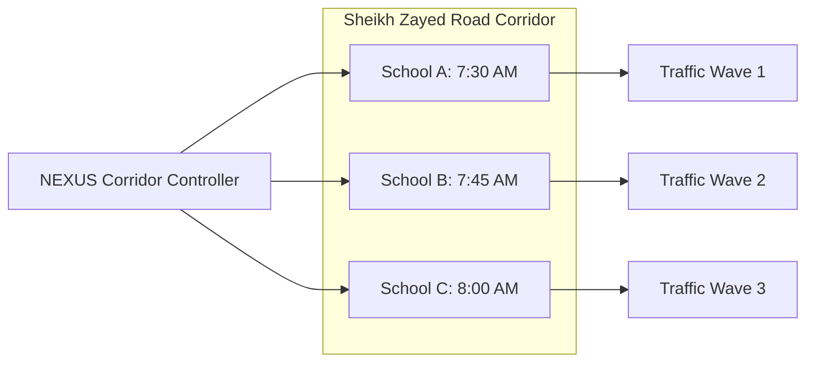
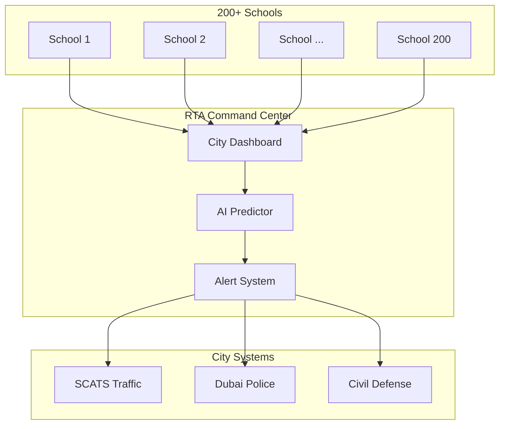

# 🗺️ RTA NEXUS: Future Roadmap
## Strategic Extensions & Long-Term Vision

---

## Executive Summary

NEXUS Phase 1 solves the immediate problem: **school zone congestion**. But the platform's architecture enables much larger possibilities. This roadmap outlines the evolution from a single-school solution to a **city-wide intelligent mobility network**.

---

## Phase 1: Foundation (Current)
**Timeline:** Hackathon → Pilot (Q1-Q2 2026)

| Deliverable | Status |
|-------------|--------|
| Core Algorithms (SAS, LDS, VQS, FLGC) | ✅ Designed |
| Mobile App (Parent) | ✅ Specified |
| School Dashboard | ✅ Specified |
| Bollard Integration | ✅ Specified |
| NOL Gamification | ✅ Specified |

**Goal:** Prove concept at 1-3 pilot schools.

---

## Phase 2: Scale & Integrate (6-12 Months)

### 2.1 Multi-School Corridor Orchestration
**Problem:** Schools on the same road cause cascading traffic.

**Impact:** Prevent overlapping traffic waves from 5+ schools.

---

### 2.2 Public Transit Sync
**Problem:** Parents arriving by Metro are not considered.

| Integration | Benefit |
|-------------|---------|
| Metro arrival times | Adjust slot based on walking ETA from station |
| Bus schedules | Coordinate school bus with dismissal waves |
| Careem/Taxi ETAs | Include ride-hail in queue system |

---

### 2.3 Predictive Absence Detection
**Problem:** System schedules slots for absent students.

**Solution:**
- Integrate with school attendance systems.
- Auto-cancel slots for absent students by 7:00 AM.
- Redistribute freed capacity to waitlist.

**Impact:** 10-15% capacity optimization on typical sick days.

---

## Phase 3: Intelligence Layer (12-24 Months)

### 3.1 Weather-Triggered Protocols
**Problem:** Rainy/hot days = different pickup behavior.

| Weather | Trigger | Protocol Change |
|---------|---------|-----------------|
| Rain | UAE Met Alert | Extend dwell times, covered zones only |
| Extreme Heat (>45°C) | Temperature sensor | Indoor staging, AC buses first |
| Sandstorm | Visibility <1km | Delay all departures, SMS fallback |

---

### 3.2 AI Teacher Delay Prediction
**Problem:** Some classes are always dismissed late.

**Solution:**
- ML model trained on historical dismissal patterns.
- Predict 3-5 min delays for specific teachers.
- Pre-adjust parent ETAs accordingly.

---

### 3.3 Carbon Credit Marketplace
**Problem:** CO2 savings are not monetized.

**Solution:**
- Track verified emissions reduction per school.
- Convert to carbon credits (UAE Green Economy standards).
- Sell credits to offset programs or reinvest in schools.

| Metric | Value |
|--------|-------|
| CO2 saved per school/year | 100+ tonnes |
| Carbon credit value | ~AED 30,000/year |

---

## Phase 4: City-Wide Vision (2+ Years)

### 4.1 Dubai School Traffic Command Center

**Features:**
- Real-time monitoring of all school zones.
- Automatic incident detection and response.
- City-wide traffic rebalancing during school hours.

---

### 4.2 Autonomous Vehicle Integration

**Problem:** AVs can't use parent apps.

**Solution:**
- V2I (Vehicle-to-Infrastructure) API.
- Bollards communicate directly with Tesla/Waymo.
- AVs receive gate commands via 5G.

---

### 4.3 Gamification 2.0

| Feature | Description |
|---------|-------------|
| Family Leaderboards | Cross-school competitions |
| Class Challenges | "Greenest Class" weekly awards |
| Annual Awards | "Dubai's Safest School Zone" |
| Kids Dashboard | Children see family's impact in class |

---

## Investment Summary

| Phase | Timeline | Investment | ROI |
|-------|----------|------------|-----|
| Phase 1 (Pilot) | 0-6 months | AED 300K | 500%+ |
| Phase 2 (Scale) | 6-12 months | AED 1.5M | 400% |
| Phase 3 (Intelligence) | 12-24 months | AED 2M | 300% |
| Phase 4 (City-Wide) | 24+ months | AED 10M | Strategic |

---

## Risk Mitigation

| Risk | Probability | Mitigation |
|------|-------------|------------|
| Low parent adoption | Medium | Strong gamification, school enforcement |
| Technical failure | Low | Graceful degradation, manual fallback |
| Regulatory changes | Low | Privacy-first design, RTA partnership |
| Competition | Medium | First-mover advantage, RTA exclusivity |

---

## Success Metrics by Phase

| Phase | KPI | Target |
|-------|-----|--------|
| 1 | Congestion reduction | 50% |
| 2 | Schools deployed | 50+ |
| 3 | City-wide time saved | 1M hours/year |
| 4 | CO2 reduction | 10,000 tonnes/year |

---

*RTA NEXUS Roadmap — Dubai's Future of School Mobility*
