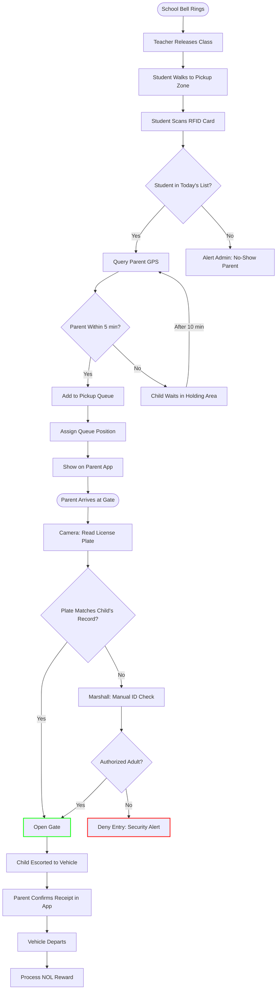

# ⚡ NEXUS: The 90-Second Pickup Protocol
## "The Secure Handoff" — A Child-Verified Exit Mechanics Guide

---

## 🎯 Concept: Airport Security Efficiency
Unlike drop-off (speed-focused), pickup prioritizes **security + speed**. Every child must be matched to an authorized adult before release. NEXUS treats pickup like an **airport baggage claim** — you can only collect what's registered to you.

---

## The Phases of the Pickup (0:00 to 1:30)

```mermaid
gantt
    title The Secure Pickup Timeline
    dateFormat s
    axisFormat %S
    
    section Phase 1: Student Ready (0-20s)
    RFID Scan at Gate      :active, 0, 5s
    System Verifies ID     :active, 5, 10s
    Parent Notified        :active, 10, 20s
    
    section Phase 2: Parent Approach (20-60s)
    Parent Proceeds        :crit, 20, 40s
    License Plate Read     :crit, 40, 50s
    Match Verified         :crit, 50, 60s
    
    section Phase 3: Handoff (60-90s)
    Gate Opens            :active, 60, 65s
    Child Walks to Vehicle :active, 65, 80s
    Secure & Depart       :active, 80, 90s
```



---

## 🧠 Logic Flowchart (Full Decision Tree)



---

## 🏫 Step-by-Step "Secure Handoff" Mechanics

### Phase 1: Student Ready (0:00 - 0:20)
**Goal: Verify child is present and parent is en-route**

| Student Action | System Response |
|----------------|-----------------|
| Walks to Pickup Zone | **Location Sensor**: Detects movement to zone |
| Scans RFID Card | **Database**: Verifies student ID `STU-20847` |
| Waits | **App (Parent)**: "Ahmed is ready! Gate B, Position #4" |
| | **Display Board**: Shows `LANE B: Ahmed K. → Vehicle ABC-1234` |

> **Safety Lock**: If parent GPS is >10 min away, child is directed to **Air-Conditioned Holding Area**.

---

### Phase 2: Parent Approach (0:20 - 1:00)
**Goal: Verify vehicle matches registered records**

| Parent Action | System Response |
|---------------|-----------------|
| Proceeds to Gate B | **App**: "Proceed to Lane B. Your child is waiting." |
| Enters camera zone | **LPR Camera**: Reads plate `ABC-1234` |
| Waits at bollard | **System**: Cross-references plate with `STU-20847` |
| | **Match Found?** → YES = Gate Opens |
| | **Match Found?** → NO = Marshall Alert |

> **Multi-Vehicle Support**: Parents with 2+ registered vehicles are recognized on any of them.

---

### Phase 3: Secure Handoff (1:00 - 1:30)
**Goal: Physical transfer of child to verified adult**

| Action | System Response |
|--------|-----------------|
| Gate Opens | **Bollard**: Retracts for 30 seconds |
| Marshall escorts child | **Camera**: Tracks child movement to vehicle |
| Child enters vehicle | **Sensor**: Detects weight shift (new passenger) |
| Parent taps "Confirm" | **App**: "Ahmed secured. Have a safe trip!" |
| Vehicle departs | **NOL System**: +1.0 AED for smooth pickup |

---

## 🛑 Handling Exceptions (The "Safety Net")

### Scenario A: Unregistered Vehicle
**Trigger:** License plate not in child's authorized list.
**Response:**
1. Gate remains **CLOSED**.
2. DMS: "Please proceed to Verification Lane."
3. Marshall approaches, requests ID.
4. If authorized → Manual override.
5. If unauthorized → Security called.

### Scenario B: Parent No-Show (After 15 mins)
**Trigger:** Child has been waiting 15+ minutes.
**Response:**
1. System: Sends escalating notifications to parent.
2. School: Admin alerted with child's name.
3. Child: Moved to **Office Holding** with supervision.
4. Parent: Flagged for follow-up (repeated = NOL penalty).

### Scenario C: Child Not at Gate
**Trigger:** Parent arrives but child hasn't scanned RFID.
**Response:**
1. App: "Ahmed hasn't checked out yet. Please wait."
2. Gate: Remains **CLOSED**.
3. School: PA announcement for child's name.
4. After 5 mins: Marshall checks classroom.

---

## 📊 Why This Works

| Metric | Traditional Pickup | NEXUS Protocol |
|--------|-------------------|----------------|
| **Verification** | Visual (parent waves) | LPR + RFID + App |
| **Child Location** | Unknown until seen | RFID-tracked |
| **Wait Time** | 10-25 minutes | < 2 minutes |
| **Security Level** | Low (easy bypass) | High (triple-check) |
| **Throughput** | ~15 cars/hr/lane | **40 cars/hr/lane** |

> [!IMPORTANT]
> **2.5x Throughput + 3x Security**: NEXUS doesn't trade speed for safety — it achieves both.

---

## 📱 Parent App View During Pickup

```
┌─────────────────────────────────────────────────────────────────┐
│                    NEXUS: PICKUP MODE                           │
├─────────────────────────────────────────────────────────────────┤
│                                                                 │
│   ✅ Ahmed is READY for pickup!                                 │
│                                                                 │
│   📍 Location: Gate B, Lane 3                                   │
│   ⏱️ Wait Time: 1 min 23 sec                                    │
│   🚗 Queue Position: #4                                         │
│                                                                 │
│   ┌─────────────────────────────────────────────────────────┐   │
│   │                                                         │   │
│   │   Your ETA: 3 minutes                                   │   │
│   │   ████████████████░░░░░░░░ 67%                          │   │
│   │                                                         │   │
│   └─────────────────────────────────────────────────────────┘   │
│                                                                 │
│   ┌─────────────────────────────────────────────────────────┐   │
│   │   [  CONFIRM PICKUP  ]                                  │   │
│   └─────────────────────────────────────────────────────────┘   │
│                                                                 │
│   💰 On-time pickup: +1.0 NOL                                   │
│                                                                 │
└─────────────────────────────────────────────────────────────────┘
```

---

*Verified Pickup Standard — RTA Hackathon 2026*
