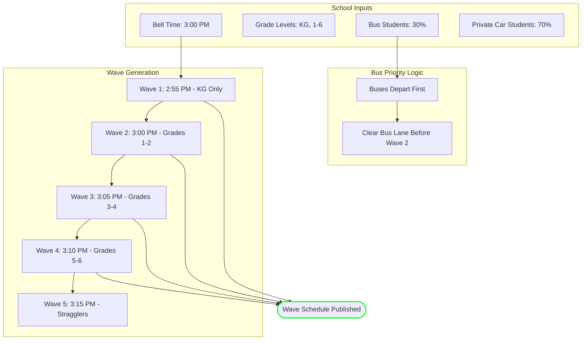
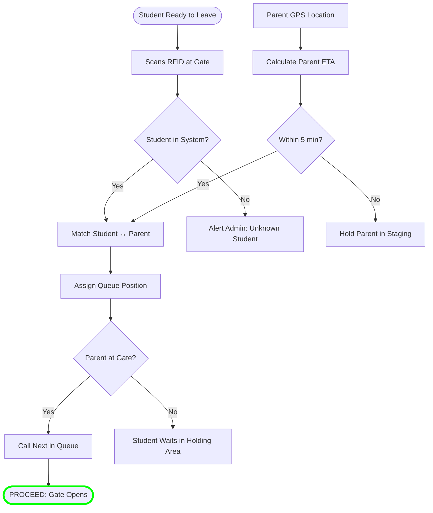
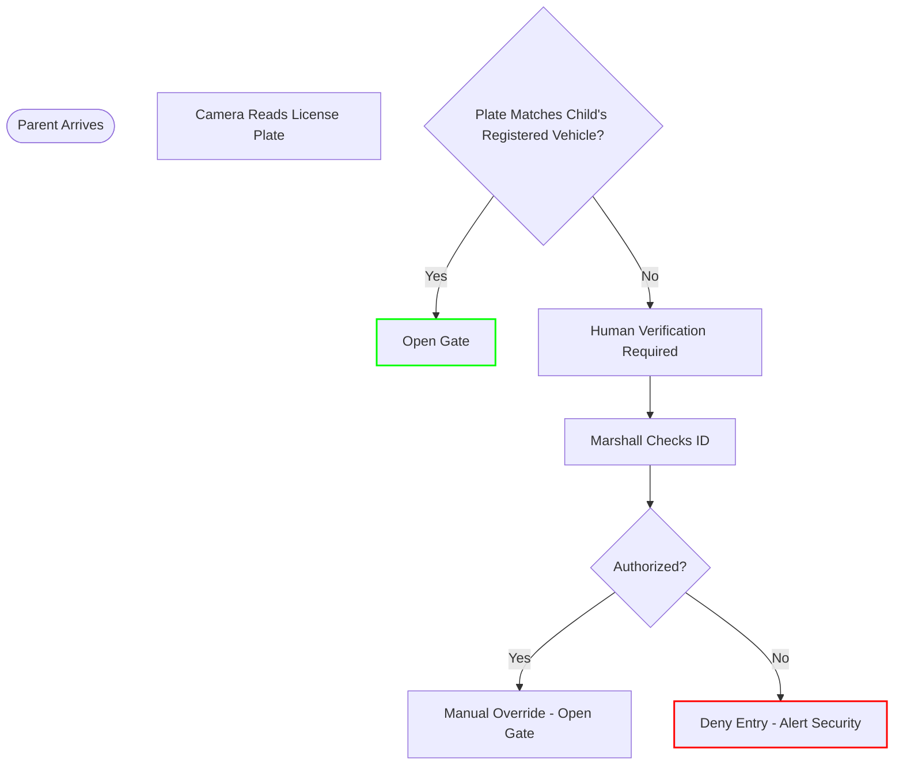

# ⏳ RTA NEXUS: Pickup Timing Determination Logic
## The Algorithms Behind "The Perfect Pickup"

---

## 🎯 Overview
Pickup is fundamentally different from drop-off because the **child's location is known** (inside the school), but the **parent's arrival is uncertain**. NEXUS inverts the control: **the child triggers the parent**, not vice-versa.

---

## Phase 1: The Static Foundation (Dismissal Waves)
**Goal:** Stagger dismissal to prevent 100% of students exiting simultaneously.

### 🧠 Algorithm: Wave Dismissal Scheduling (WDS)

### Key Logic Rules
1. **Youngest First**: KG dismissed 5 mins early (parents most anxious, need more time).
2. **Bus Priority**: Buses depart during Wave 1-2 gap to avoid private car conflicts.
3. **Straggler Buffer**: Wave 5 catches any missed students or late parents.

---

## Phase 2: The Real-Time Trigger (Child-Initiated)
**Goal:** Parent only proceeds when child is **physically at the gate**.

### 🧠 Algorithm: Student-Ready Sync (SRS)

---

## The "Golden Calculation" for Pickup

$$
T_{call} = T_{rfid} + \Delta T_{queue} + B_{safety}
$$

| Variable | Definition | Typical Value |
|----------|------------|---------------|
| $T_{rfid}$ | Time student scans RFID | 3:02 PM |
| $\Delta T_{queue}$ | Queue wait based on position | 4 mins (Position #8) |
| $B_{safety}$ | Buffer for student walk to gate | 1 min |

**Example Calculation:**
1. Student scans RFID at **3:02 PM**.
2. Queue position is **#8** → ~4 min wait.
3. Buffer of **1 min** added.
5. **Determined Call Time:** 3:02 + 5 = **3:07 PM**.

> **System Action**: Parent app shows "Your child is ready! ETA to gate: **3:07 PM**"

---

## The Dual-Verification Protocol

### What if parent arrives before child scans?
**Logic:** `IF (Parent_GPS == AT_GATE) AND (Child_RFID == NOT_SCANNED)`
**Action:** 
- App: "Your child hasn't checked out yet. Please wait."
- System: Holds gate closed.

### What if child scans but parent is far away?
**Logic:** `IF (Child_RFID == SCANNED) AND (Parent_ETA > 10 min)`
**Action:**
- App: "Your child is waiting. Please proceed to school."
- School: Child sent to **Supervised Holding Area**.

### What if parent is a no-show?
**Logic:** `IF (Child_Wait_Time > 20 min)`
**Action:**
- System: Escalates to school admin.
- Parent: Repeated app notifications.
- Child: Remains in secured holding area.

---

## Exception Handling: The "Wrong Parent" Problem

---

## Summary: Pickup vs Drop-off Logic

| Aspect | Drop-off | Pickup |
|--------|----------|--------|
| **Trigger** | Parent "Leaving Now" | Child RFID Scan |
| **ETA Source** | Traffic API | Parent GPS |
| **Primary Wait** | Parent in Staging | Child in Holding Area |
| **Gate Opens** | When parent ETA matches slot | When parent at gate + child verified |
| **Safety Check** | Bollard + Weight Sensor | LPR + RFID Match |

---

*System Logic Specification — RTA NEXUS Pickup Module*
