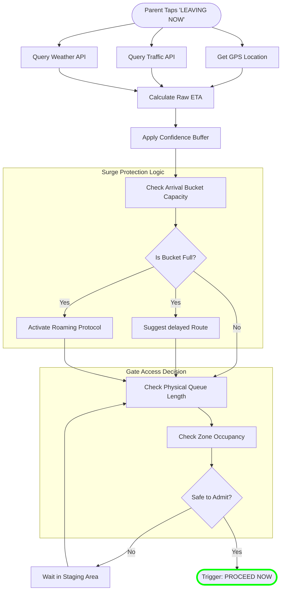

# ⏳ RTA NEXUS: Timing Determination Logic
## The Algorithms Behind "The Perfect Arrival"

---

## 🎯 Overview
Uniquely, NEXUS calculates "Time" in two distinct phases. It relies on a **Static Control** (The Plan) and a **Dynamic Control** (The Reality). This document details exactly how the system determines the specific millisecond a parent is allowed to enter the drop-off zone.

---

## Phase 1: The Static Assignment (The Plan)
**Goal:** Create a mathematically perfect schedule before the school year begins.

### 🧠 Algorithm: Staggered Arrival Scheduling (SAS)
This algorithm runs nightly or before the term starts to assign the "Target Time".

```mermaid
flowchart TD
    subgraph INPUTS ["Input Variables"]
        STD[Student Database]
        PREF[Parent Preferences]
        CAP[Zone Capacity (Vehicles/Min)]
        WIN[Arrival Window (e.g. 7:00-8:00)]
    end

    subgraph PRE_PROCESS ["Pre-Processing"]
        STD --> SIB[Step 1: Sibling Grouping]
        SIB --> GEO[Step 2: Geo-Clustering]
        GEO --> VOL[Step 3: Calculate Cohort Volume]
    end

    subgraph ASSIGNMENT ["Constraint Satisfaction Engine"]
        VOL --> SLOT_GEN[Generate Time Slots (5-min buckets)]
        SLOT_GEN --> FILL{Slot Full?}
        
        FILL -->|No| ASSIGN[Assign Family to Slot]
        FILL -->|Yes| NEXT[Move to Adjacent Slot]
        
        PREF -->|High Priority| ASSIGN
        GEO -->|Spread Neighbors| NEXT
    end

    ASSIGN --> OUTPUT([Final Assigned Target Time])
    
    style OUTPUT stroke:#00ff00,stroke-width:2px
```

### Key Logic Rules
1. **Sibling Rule**: Families with multiple children are treated as **one vehicle entity**.
2. **Cluster Rule**: Neighbors (within 500m) are **deliberately separated** by 10 mins to prevent convoy congestion.
3. **Capacity Cap**: No slot can exceed 85% of physical gate capacity (15% reserved for variance).

---

## Phase 2: The Real-Time Trigger (The Reality)
**Goal:** Adjust the "Target Time" based on Traffic, Weather, and actual movement.

### 🧠 Algorithm: Live Departure Sync (LDS)
This runs in real-time (every 30 seconds) while the parent is en-route.



---

## The "Golden Calculation"
How the specific arrival minute is calculated code-level:

$$
T_{arrival} = T_{current} + \frac{D_{route}}{V_{traffic}} \times F_{weather} + B_{safety}
$$

| Variable | Definition | Typical Value |
|----------|------------|---------------|
| $T_{current}$ | Time of "Leaving Now" tap | 7:15 AM |
| $D_{route}$ | Distance to school | 12.5 km |
| $V_{traffic}$ | Real-time traffic speed | 45 km/h |
| $F_{weather}$ | Weather Friction Factor | 1.0 (Sunny) / 1.15 (Rain) |
| $B_{safety}$ | Dynamic Safety Buffer | 3 mins |

**Example Calculation:**
1. Parent leaves at **7:15 AM**.
2. Maps API says drive is **18 mins**.
3. It is **Raining** ($F=1.15$) $\rightarrow$ $18 \times 1.15 = 20.7$ mins.
4. System adds **3 min** buffer $\rightarrow$ $23.7$ mins.
5. **Determined Arrival Time:** 7:15 + 24 mins = **7:39 AM**.

> **System Action**: The system reserves a gate slot specifically for **7:39 AM**.

---

## Exception Handling Logic

### What if they arrive too early?
**Logic:** `IF (Actual_Arrival < Determined_Time - 5min)`
**Action:** Direct to **Virtual Staging Zone** (Coffee Shop). Do not open gate.

### What if they arrive too late?
**Logic:** `IF (Actual_Arrival > Determined_Time + 10min)`
**Action:** Flag as "Missed Slot". Re-queue at lowest priority (Tier C).

### What if the gate is jammed?
**Logic:** `IF (Gate_Sensor == BLOCKED)`
**Action:** Broadcast specific `HOLD` command to en-route parents. Add +2 mins to their ETAs.

---

*System Logic Specification — RTA NEXUS*
